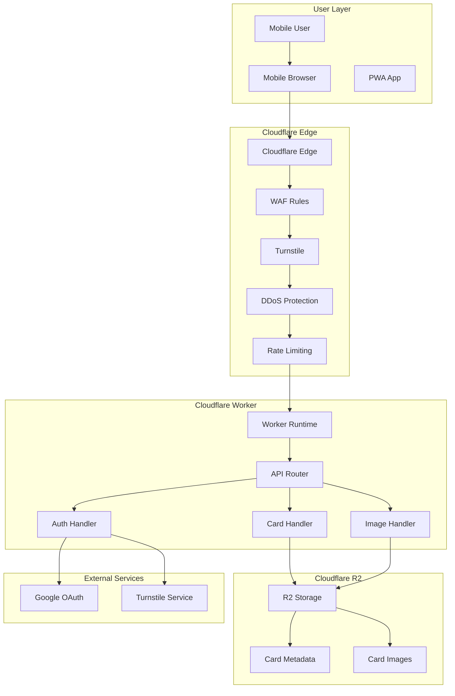
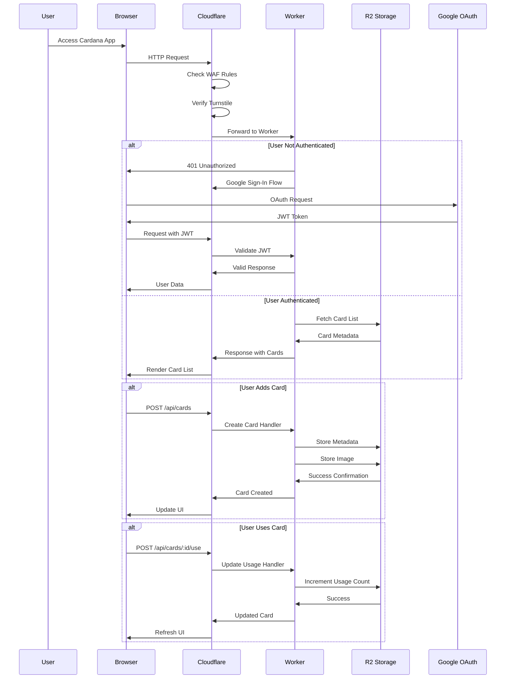
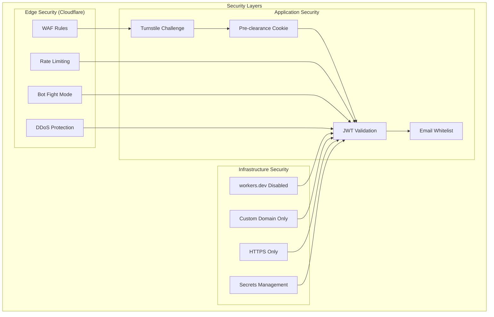
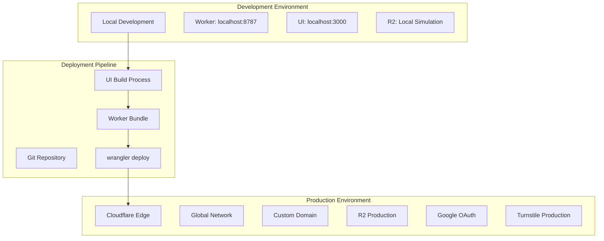

# Plan

## Table of Contents

- [Architecture](#architecture)
  - [Deployment shape](#deployment-shape)
  - [Backend surface area](#backend-surface-area)
  - [Security model](#security-model)
  - [Security rules (mandatory)](#security-rules-mandatory)
  - [Additional DDoS protection (free tier)](#additional-ddos-protection-free-tier)
  - [Cost protection summary](#cost-protection-summary)
  - [Client ↔ backend responsibilities](#client--backend-responsibilities)
  - [Identity & authorization model](#identity--authorization-model)
  - [Startup / performance posture](#startup--performance-posture)
  - [Data model](#data-model)
  - [Data storage](#data-storage)
  - [Hosting](#hosting)
  - [Backups](#backups)
  - [R2 privacy](#r2-privacy)
- [Deployment](#deployment)
  - [Prerequisites](#prerequisites)
  - [Step 1: Create Cloudflare account](#step-1-create-cloudflare-account)
  - [Step 2: Install wrangler CLI](#step-2-install-wrangler-cli)
  - [Step 3: Authenticate wrangler](#step-3-authenticate-wrangler)
  - [Step 4: Get account ID](#step-4-get-account-id)
  - [Step 5: Create R2 bucket](#step-5-create-r2-bucket)
  - [Step 6: Add domain to Cloudflare (optional but recommended)](#step-6-add-domain-to-cloudflare-optional-but-recommended)
  - [Step 7: Set up Google OAuth](#step-7-set-up-google-oauth)
  - [Step 8: Create Turnstile widget](#step-8-create-turnstile-widget)
  - [Step 9: Configure WAF rules](#step-9-configure-waf-rules)
  - [Step 10: Enable additional protections](#step-10-enable-additional-protections)
  - [Step 11: Create wrangler.toml](#step-11-create-wranglertoml)
  - [Step 12: Set secrets](#step-12-set-secrets)
  - [Step 13: Build and deploy](#step-13-build-and-deploy)
  - [Step 14: Verify deployment](#step-14-verify-deployment)
  - [Deployment folder structure](#deployment-folder-structure)
  - [Deployment scripts](#deployment-scripts)
  - [Secrets management](#secrets-management)
  - [Local development](#local-development)
- [UI Technology](#ui-technology)
  - [Framework](#framework)
  - [Styling](#styling)
  - [Build tool](#build-tool)
  - [Component library](#component-library)
- [Features](#features)
  - [Platform](#platform)
  - [Session / authentication](#session--authentication)
  - [Navigation](#navigation)
  - [Card list view (home screen)](#card-list-view-home-screen)
  - [Card detail / flip](#card-detail--flip)
  - [Add new card](#add-new-card)
  - [Edit / delete card](#edit--delete-card)
  - [Card data model](#card-data-model)
- [Code Structure](#code-structure)
  - [Repository layout](#repository-layout)
  - [Monorepo](#monorepo)
  - [Worker framework](#worker-framework)
  - [Language](#language)
- [Backend API](#backend-api)
  - [Design principles](#design-principles)
  - [Authentication](#authentication)
  - [Endpoints](#endpoints)
  - [Static files](#static-files)
  - [Input validation](#input-validation)
- [Production Maintenance](#production-maintenance)
  - [Monitoring & Alerting](#monitoring--alerting)
  - [Backup & Disaster Recovery](#backup--disaster-recovery)
  - [Security Maintenance](#security-maintenance)
  - [Performance Monitoring](#performance-monitoring)
  - [Dependency Updates](#dependency-updates)
  - [Common Production Issues](#common-production-issues)
  - [Maintenance Procedures](#maintenance-procedures)
  - [Emergency Response](#emergency-response)
- [Mobile Strategy & Responsiveness](#mobile-strategy--responsiveness)
  - [Mobile-First Design Principles](#mobile-first-design-principles)
  - [Responsive Breakpoints](#responsive-breakpoints)
  - [Touch Interactions](#touch-interactions)
  - [Mobile Performance](#mobile-performance)
  - [Mobile Browser Compatibility](#mobile-browser-compatibility)
  - [Mobile-Specific Features](#mobile-specific-features)
  - [Mobile Testing Strategy](#mobile-testing-strategy)
  - [Progressive Web App (PWA)](#progressive-web-app-pwa)
  - [Mobile Accessibility](#mobile-accessibility)
  - [Common Mobile Issues](#common-mobile-issues)

## Architecture

### System Architecture Overview



### Data Flow Architecture



### Security Architecture



### Deployment Architecture



### Deployment shape

- `index.html` loads a single app bundle `index.js` (minified).
- Additional static UI assets (CSS, images, fonts, etc.) are allowed.
- The application runs on **Cloudflare Workers** (serverless edge compute).
- Static assets and API served from the same Worker.

### Backend surface area

- A **Cloudflare Worker** serves both static files and API endpoints.
- Cloudflare provides HTTPS termination.
- **Cloudflare Turnstile** with **pre-clearance** issues `cf_clearance` cookie on challenge pass.
- **WAF custom rule** blocks requests without valid `cf_clearance` cookie.
- Blocked requests **never invoke the Worker** (no cost).

### Security model

- **Turnstile** (site-wide challenge) — user must pass before accessing app.
- **WAF rule** — blocks requests without `cf_clearance` cookie (before Worker runs).
- **Rate limiting rule** — blocks abusive IPs (before Worker runs).
- No origin server to bypass — Worker IS on Cloudflare's edge.

### Security rules (mandatory)

1. **WAF Rule: Require `cf_clearance` cookie**
   - Block all requests that do not have a valid `cf_clearance` cookie.
   - This ensures Turnstile challenge was completed.
   - Blocked requests do not invoke the Worker (no cost).

2. **Hide Worker origin**
   - Do NOT expose or share the `*.workers.dev` URL publicly.
   - Use a custom domain (e.g., `cardana.yourdomain.com`) routed through Cloudflare.
   - Disable the `*.workers.dev` route in `wrangler.toml` if possible.

3. **Rate limiting rule**
   - Limit to **40 requests/minute globally** (not per IP).
   - Exceeding the limit → block all requests temporarily.
   - Blocked at WAF layer → Worker not invoked.

### Additional DDoS protection (free tier)

4. **Cloudflare DDoS protection**
   - Enabled by default on all Cloudflare plans (including free).
   - Automatically mitigates L3/L4 and L7 DDoS attacks.

5. **Bot Fight Mode**
   - Enable in Cloudflare dashboard (Security → Bots).
   - Challenges known bot traffic before it reaches the Worker.

6. **Browser Integrity Check**
   - Enable in Cloudflare dashboard (Security → Settings).
   - Blocks requests with suspicious HTTP headers.

7. **Challenge Passage TTL**
   - Set a reasonable TTL for `cf_clearance` cookie (e.g., 30 minutes).
   - Forces re-challenge periodically to prevent token abuse.

8. **Disable unused features**
   - Do not enable WebSockets, Cron Triggers, or Durable Objects unless needed.
   - Reduces attack surface.

### Cost protection summary

| Protection | Layer | Blocks before Worker? | Free? |
|------------|-------|----------------------|-------|
| Turnstile + WAF rule | WAF | ✅ Yes | ✅ Yes |
| Rate limiting | WAF | ✅ Yes | ✅ Yes (1 rule) |
| DDoS protection | Network | ✅ Yes | ✅ Yes |
| Bot Fight Mode | WAF | ✅ Yes | ✅ Yes |
| Browser Integrity Check | WAF | ✅ Yes | ✅ Yes |

### Client ↔ backend responsibilities

- The client is responsible for all UI state management.
- The client communicates with the Worker over HTTPS.
- The Worker is the policy enforcement point for authentication.

### Identity & authorization model

- Access requires a logged-in user via **Google authentication**.
- UI handles Google OAuth via Google Sign-In SDK.
- UI sends JWT in `Authorization: Bearer <token>` header.
- Worker validates JWT signature using Google's public keys (cached).
- **All logged-in users share the same data** (no per-user isolation).
- All logged-in users can read and write cards.

### Startup / performance posture

- Render immediately: show an app shell without waiting for auth or data.
- If not logged in, show an explicit sign-in screen ("Sign in with Google").
- Only after login, initiate API calls and show a loading state until the first fetch resolves.
- **No cold start** — Workers are always warm at the edge.

### Data model

- A **card** consists of:
  - A JPEG image (photo)
  - Metadata (JSON)
- All cards are shared across all users.

### Data storage

- Data is stored in **Cloudflare R2** (S3-compatible object storage).
- Worker uses R2 API to read/write objects.
- Storage structure:
  ```
  cards/
    {cardId}.jpg
    {cardId}.json
  ```
- No database; cards are stored as objects.

### Hosting

- **Compute**: Cloudflare Workers (free tier: 100K requests/day, ~3M/month).
- **Storage**: Cloudflare R2 (free tier: 10 GB, **zero egress fees**).
- **CDN / Security**: Cloudflare (free tier) with Turnstile + WAF + rate limiting.
- **Cost target**: $0 under normal usage.

### Backups

- R2 does not have built-in versioning (as of now).
- Option: periodic backup script to copy objects to a backup bucket or local.

### R2 privacy

- R2 buckets are **private by default**.
- No public URL exists unless explicitly created.
- Worker accesses R2 via **binding** (not HTTP URL).
- Only the Worker can read/write to the bucket.

### Deployment

Complete deployment guide from scratch. Assumes nothing exists.

#### Prerequisites

- Node.js 18+ installed
- npm installed
- A domain name (optional but recommended for custom domain)

#### Step 1: Create Cloudflare account

1. Go to https://dash.cloudflare.com/sign-up
2. Enter email and password
3. Verify email
4. Select **Free** plan (sufficient for this app)

#### Step 2: Install wrangler CLI

```bash
npm install -g wrangler
```

#### Step 3: Authenticate wrangler

```bash
wrangler login
```

This opens a browser window. Log in and authorize wrangler.

#### Step 4: Get account ID

```bash
wrangler whoami
```

Note your **Account ID** — you'll need it for `wrangler.toml`.

#### Step 5: Create R2 bucket

**Option A: Dashboard**
1. Go to Cloudflare Dashboard → R2
2. Click "Create bucket"
3. Name: `cardana-cards`
4. Location: Auto (or choose nearest region)

**Option B: CLI**
```bash
wrangler r2 bucket create cardana-cards
```

#### Step 6: Add domain to Cloudflare (optional but recommended)

1. Go to Cloudflare Dashboard → Websites → Add a site
2. Enter your domain name
3. Select **Free** plan
4. Cloudflare provides nameservers
5. Update your domain registrar to use Cloudflare nameservers
6. Wait for DNS propagation (up to 24 hours)

#### Step 7: Set up Google OAuth

**A. Create Google Cloud account (if you don't have one)**

1. Go to https://console.cloud.google.com/
2. Click "Get started for free" or sign in with your Google account
3. Accept terms of service
4. You do NOT need to enable billing for OAuth

**B. Create a new project**

1. Click the project dropdown at the top (says "Select a project")
2. Click "New Project"
3. Project name: `Cardana`
4. Organization: leave as default (or "No organization")
5. Click "Create"
6. Wait for project to be created (~10 seconds)
7. Select the new project from the dropdown

**C. Configure OAuth consent screen**

1. Go to **APIs & Services → OAuth consent screen** (left sidebar)
2. User Type: Select **External** (unless you have Google Workspace)
3. Click "Create"
4. Fill in the form:
   - App name: `Cardana`
   - User support email: your email
   - Developer contact email: your email
5. Click "Save and Continue"
6. Scopes: Click "Save and Continue" (no scopes needed)
7. Test users: Click "Add Users" → add your email → "Save and Continue"
8. Click "Back to Dashboard"

**D. Create OAuth credentials**

1. Go to **APIs & Services → Credentials** (left sidebar)
2. Click "+ Create Credentials" → "OAuth client ID"
3. Application type: **Web application**
4. Name: `Cardana Web Client`
5. Authorized JavaScript origins (click "Add URI" for each):
   - `http://localhost:3000`
   - `http://localhost:8787`
   - `https://cardana.yourdomain.com` (your production domain)
6. Authorized redirect URIs: leave empty
7. Click "Create"
8. **Copy the Client ID** — looks like: `123456789-abc.apps.googleusercontent.com`
9. Click "OK"

**E. Save the Client ID**

Store this securely. You'll use it in:
- Worker secret: `wrangler secret put GOOGLE_CLIENT_ID`
- UI config: passed to Google Sign-In SDK

**Note**: No Client Secret needed — we use Google Sign-In for Websites (implicit flow), and the Worker validates the JWT using Google's public keys.

#### Step 8: Create Turnstile widget

**A. Navigate to Turnstile**

1. Go to https://dash.cloudflare.com/
2. In the left sidebar, click **Turnstile** (under "Manage Account")
3. If first time, you may need to accept terms

**B. Create the widget**

1. Click "Add widget" (blue button)
2. Fill in the form:
   - Widget name: `cardana`
   - Hostname: click "Add hostname"
     - Add: `localhost` (for dev)
     - Add: `cardana.yourdomain.com` (your production domain)
   - Widget Mode: **Managed** (recommended)
3. Scroll down to "Pre-Clearance"
4. Toggle "Enable Pre-Clearance" to **ON**
5. Pre-clearance level: **Managed**
6. Click "Create"

**C. Save the keys**

After creation, you'll see:
- **Site Key**: `0x4AAAAAAA...` — used in the UI (public)
- **Secret Key**: `0x4AAAAAAA...` — used in the Worker (private)

Copy both and store securely.

#### Step 9: Configure WAF rules

**A. Navigate to WAF**

1. Go to Cloudflare Dashboard
2. Select your domain (click on it under "Websites")
3. In the left sidebar, click **Security → WAF**

**B. Create Rule 1: Require cf_clearance cookie**

1. Click on "Custom rules" tab
2. Click "Create rule"
3. Rule name: `Require Turnstile clearance`
4. In "When incoming requests match..." section:
   - Field: `Cookie`
   - Operator: `does not contain`
   - Value: `cf_clearance`
   - OR use Expression Editor and paste: `(not http.cookie contains "cf_clearance")`
5. Then take action: **Block**
6. Click "Deploy"

**C. Create Rule 2: Rate limiting**

1. Go to **Security → WAF → Rate limiting rules**
2. Click "Create rule"
3. Rule name: `Global rate limit 40/min`
4. In "When incoming requests match...":
   - Use Expression Editor: `true` (matches all requests)
5. With the same characteristics: leave empty (global, not per-IP)
6. When rate exceeds:
   - Requests: `40`
   - Period: `1 minute`
7. Then take action: **Block**
8. For duration: `1 minute`
9. Click "Deploy"

#### Step 10: Enable additional protections

**A. Enable Bot Fight Mode**

1. Go to **Security → Bots**
2. Find "Bot Fight Mode"
3. Toggle to **ON**

**B. Enable Browser Integrity Check**

1. Go to **Security → Settings**
2. Find "Browser Integrity Check"
3. Toggle to **ON**

**C. Set Challenge Passage duration**

1. Stay on **Security → Settings**
2. Find "Challenge Passage"
3. Set to **30 minutes** (or your preference)

#### Step 11: Create wrangler.toml

In the `worker/` folder, create `wrangler.toml`:

```toml
name = "cardana"
main = "src/index.ts"
compatibility_date = "2024-01-01"

# Replace with your account ID
account_id = "YOUR_ACCOUNT_ID"

# R2 bucket binding
[[r2_buckets]]
binding = "CARDS_BUCKET"
bucket_name = "cardana-cards"

# Environment variables (secrets set via wrangler secret)
[vars]
TURNSTILE_SITE_KEY = "YOUR_TURNSTILE_SITE_KEY"

# Custom domain (optional)
# routes = [
#   { pattern = "cardana.yourdomain.com/*", zone_name = "yourdomain.com" }
# ]
```

#### Step 12: Set secrets

```bash
cd worker
wrangler secret put TURNSTILE_SECRET_KEY
# Paste your Turnstile secret key when prompted

wrangler secret put GOOGLE_CLIENT_ID
# Paste your Google OAuth client ID when prompted
```

#### Step 13: Build and deploy

```bash
# From project root
./deployment/deploy.sh
```

Or manually:

```bash
# Build UI
cd ui
npm install
npm run build

# Deploy Worker
cd ../worker
npm install
wrangler deploy
```

#### Step 14: Verify deployment

1. Visit your Worker URL: `https://cardana.YOUR_ACCOUNT.workers.dev`
2. Or your custom domain: `https://cardana.yourdomain.com`
3. You should see the Turnstile challenge first
4. After passing, you should see the login screen

### Deployment folder structure

```
deployment/
├── deploy.sh                 # Full deployment script
├── setup-cloudflare.md       # Manual Cloudflare setup guide
├── wrangler.toml.example     # Example wrangler config
└── secrets.example           # List of required secrets
```

### Deployment scripts

#### deploy.sh

```bash
#!/bin/bash
set -e

echo "=== Cardana Deployment ==="

# Check wrangler is installed
if ! command -v wrangler &> /dev/null; then
    echo "Error: wrangler not installed. Run: npm install -g wrangler"
    exit 1
fi

# Check wrangler is authenticated
if ! wrangler whoami &> /dev/null; then
    echo "Error: Not authenticated. Run: wrangler login"
    exit 1
fi

cd "$(dirname "$0")/.."

# Build UI
echo "Step 1: Building UI..."
cd ui
npm install
npm run build
cd ..

# Copy UI dist to worker (if bundling with worker)
echo "Step 2: Copying UI assets..."
cp -r ui/dist/* worker/public/

# Deploy Worker
echo "Step 3: Deploying Worker..."
cd worker
npm install
wrangler deploy

echo ""
echo "=== Deployment complete ==="
echo "Visit your Worker at the URL shown above."
```

#### setup-r2.sh

```bash
#!/bin/bash
set -e

echo "=== R2 Bucket Setup ==="

# Check wrangler is authenticated
if ! wrangler whoami &> /dev/null; then
    echo "Error: Not authenticated. Run: wrangler login"
    exit 1
fi

BUCKET_NAME="cardana-cards"

echo "Creating R2 bucket: $BUCKET_NAME"
wrangler r2 bucket create $BUCKET_NAME

echo ""
echo "=== R2 bucket created ==="
echo "Add this to your wrangler.toml:"
echo ""
echo "[[r2_buckets]]"
echo "binding = \"CARDS_BUCKET\""
echo "bucket_name = \"$BUCKET_NAME\""
```

#### set-secrets.sh

```bash
#!/bin/bash
set -e

echo "=== Setting Worker Secrets ==="

cd "$(dirname "$0")/../worker"

echo "Setting TURNSTILE_SECRET_KEY..."
wrangler secret put TURNSTILE_SECRET_KEY

echo "Setting GOOGLE_CLIENT_ID..."
wrangler secret put GOOGLE_CLIENT_ID

echo ""
echo "=== Secrets configured ==="
```

### Secrets management

Secrets are stored **encrypted in Cloudflare** — not in code or git.

| Secret | Purpose | How to set |
|--------|---------|------------|
| `TURNSTILE_SECRET_KEY` | Validate Turnstile tokens | `wrangler secret put TURNSTILE_SECRET_KEY` |
| `GOOGLE_CLIENT_ID` | Validate Google JWTs | `wrangler secret put GOOGLE_CLIENT_ID` |

**In Worker code**, access via `env`:

```typescript
export default {
  async fetch(request, env) {
    const googleClientId = env.GOOGLE_CLIENT_ID;
    const turnstileSecret = env.TURNSTILE_SECRET_KEY;
  }
}
```

### Local development

#### Step 1: Create `.dev.vars` file

In `worker/` folder, create `.dev.vars` (gitignored):

```
TURNSTILE_SECRET_KEY=your-dev-turnstile-secret
GOOGLE_CLIENT_ID=your-google-client-id
```

#### Step 2: Create local R2 bucket (optional)

Wrangler can simulate R2 locally using local file storage.

In `wrangler.toml`, add:

```toml
[[r2_buckets]]
binding = "CARDS_BUCKET"
bucket_name = "cardana-cards"
preview_bucket_name = "cardana-cards-dev"
```

#### Step 3: Run the Worker locally

```bash
cd worker
wrangler dev
```

This starts a local server at `http://localhost:8787`.

#### Step 4: Run the UI locally (separate terminal)

```bash
cd ui
npm run dev
```

This starts the UI dev server (e.g., `http://localhost:3000`).

#### Step 5: Configure UI to use local Worker

In `ui/src/api.ts`, set the API base URL:

```typescript
const API_BASE = import.meta.env.DEV 
  ? 'http://localhost:8787' 
  : '';  // same origin in production
```

#### Local development notes

- **Turnstile**: In dev mode, use Turnstile's test keys (always pass/fail).
  - Test site key: `1x00000000000000000000AA` (always passes)
  - Test secret key: `1x0000000000000000000000000000000AA` (always passes)
- **Google OAuth**: Use a test Google OAuth client with `http://localhost:3000` as authorized origin.
- **R2**: Wrangler simulates R2 with local file storage in `.wrangler/state/`.

#### Full local dev command

```bash
# Terminal 1: Worker
cd worker && wrangler dev

# Terminal 2: UI
cd ui && npm run dev
```

## UI Technology

### Framework

- **Vanilla JavaScript** (no framework).
- Prioritizes smallest possible bundle size to minimize latency and egress.

### Styling

- **Plain CSS**.
- No CSS-in-JS, no utility frameworks.

### Build tool

- **esbuild**.
- Fast builds, minimal config, excellent tree-shaking.
- Produces smallest possible output.

### Component library

- None. Custom styling only.

## Features

### Platform

- **Mobile-only** — the sole target platform.
- Touch-friendly, responsive design.

### Session / authentication

- Long-lived session (avoid re-login on each visit).
- Store **Google refresh token** on client.
- Use refresh token to silently obtain new access tokens.

### Navigation

- **Header bar**:
  - Left: **hamburger menu** (opens side menu).
  - Right: **profile picture** (opens profile section).
- **Hamburger menu**:
  - Option to add a new card.
- **Profile section**:
  - Shows user profile picture.
  - **Log out** button.

### Card list view (home screen)

- Displays all cards in a list.
- Each card shows:
  - **Merchant name**
  - **JPEG image** (front of card)
- Cards sorted by **MRU** (Most Recently Used) — most used cards appear first.
- Cards loaded from backend.

### Card detail / flip

- Tap a card → **flip animation** → shows **barcode** on back.
- Barcode is **enlarged** for easy scanning.
- Tap again → returns to card list.
- Each flip increments the card's usage count (for MRU sorting).

### Add new card

- Accessed via hamburger menu.
- Flow:
  1. **Take photo of barcode** (camera access).
  2. System **scans barcode** → extracts barcode data.
  3. Barcode stored as **metadata** (not as image).
  4. **Take photo of card front** (the nice visual for the list).
  5. Simple form: enter **merchant name** (required).
  6. Save card.

### Edit / delete card

- Users can **edit** existing cards (update merchant name, retake photos).
- Users can **delete** cards.

### Card data model

- **cardId**: unique identifier
- **merchantName**: string
- **barcodeData**: string (scanned barcode value)
- **barcodeFormat**: string (e.g., "QR", "CODE_128", "EAN_13")
- **usageCount**: number (for MRU sorting)
- **lastUsed**: timestamp
- **createdAt**: timestamp
- **frontImage**: JPEG filename

## Code Structure

### Repository layout

```
cardana/
├── ui/                       # Frontend (vanilla TS)
│   ├── src/
│   │   ├── index.ts          # entry point
│   │   ├── api.ts            # Worker API calls
│   │   ├── auth.ts           # Google auth, token refresh
│   │   ├── scanner.ts        # barcode scanning
│   │   ├── cardList.ts       # card list view
│   │   ├── cardFlip.ts       # flip animation + barcode display
│   │   ├── addCard.ts        # add card flow
│   │   ├── nav.ts            # header, hamburger, profile
│   │   └── login.ts          # login screen
│   ├── tsconfig.json
│   ├── public/
│   │   ├── index.html
│   │   └── styles.css
│   └── package.json
│
├── worker/                   # Cloudflare Worker (TS)
│   ├── src/
│   │   ├── index.ts          # entry point (fetch handler)
│   │   ├── router.ts         # route matching
│   │   ├── auth.ts           # JWT validation
│   │   ├── cards.ts          # CRUD handlers for cards
│   │   └── storage.ts        # R2 read/write
│   ├── wrangler.toml         # Cloudflare Worker config
│   ├── tsconfig.json
│   └── package.json
│
├── deployment/               # Deployment scripts
│   ├── README.md             # Deployment instructions
│   ├── deploy-worker.sh      # Build UI + deploy Worker
│   ├── update-waf.sh         # Configure WAF rules
│   └── waf-rules.json        # WAF rule definitions
│
├── plan/                     # Planning docs
│   └── plan.md
│
├── tests/                    # Test files
│   ├── ui/
│   └── worker/
│
├── genAIStatistics/          # AI planning metrics
│   └── planning-stats.json   # Session stats, decisions, tokens
│
└── package.json              # Root package.json (workspaces)
```

### Monorepo

- Single repository for all code.
- npm/yarn workspaces for dependency management.

### Worker framework

- **Cloudflare Workers** with **wrangler** CLI for deployment.
- No Express — uses native Worker `fetch` handler.

### Language

- **TypeScript** — for both frontend and Worker.
- esbuild handles TS compilation for frontend.
- wrangler handles TS compilation for Worker.

## Backend API

### Design principles

- **REST** style endpoints.
- **Stateless** — no server-side session.
- UI handles Google OAuth via Google Sign-In SDK.
- UI sends JWT in `Authorization: Bearer <token>` header.
- Worker validates JWT signature using Google's public keys (cached).

### Authentication

- All `/api/*` endpoints require valid Google JWT.
- Worker validates token signature locally (no call to Google per request).

### Endpoints

#### List cards

```
GET /api/cards
Authorization: Bearer <token>

Response 200:
{
  "cards": [
    {
      "cardId": "abc123",
      "merchantName": "Costco",
      "barcodeData": "1234567890",
      "barcodeFormat": "CODE_128",
      "usageCount": 5,
      "lastUsed": "2026-01-30T10:00:00Z",
      "createdAt": "2026-01-01T12:00:00Z",
      "frontImageUrl": "/api/cards/abc123/image"
    }
  ]
}
```

- UI sorts by MRU (most recently used).

#### Create card

```
POST /api/cards
Authorization: Bearer <token>
Content-Type: multipart/form-data

Body:
- merchantName: string
- barcodeData: string
- barcodeFormat: string
- frontImage: file (JPEG)

Response 201:
{
  "cardId": "abc123",
  ...
}
```

#### Update card

```
PUT /api/cards/:id
Authorization: Bearer <token>
Content-Type: multipart/form-data

Body (all optional):
- merchantName: string
- barcodeData: string
- barcodeFormat: string
- frontImage: file (JPEG)

Response 200:
{
  "cardId": "abc123",
  ...
}
```

#### Delete card

```
DELETE /api/cards/:id
Authorization: Bearer <token>

Response 204 (No Content)
```

#### Get card image

```
GET /api/cards/:id/image
Authorization: Bearer <token>

Response 200:
Content-Type: image/jpeg
Cache-Control: public, max-age=31536000

<binary JPEG data>
```

- Long cache headers for browser caching.

#### Record card usage

```
POST /api/cards/:id/use
Authorization: Bearer <token>

Response 200:
{
  "usageCount": 6,
  "lastUsed": "2026-01-31T21:12:00Z"
}
```

- Called when user flips card to view barcode.

### Static files

```
GET /           → index.html
GET /index.js   → bundled JS
GET /styles.css → CSS
```

- Worker serves frontend static files (bundled or from R2).

### Input validation

- **Worker** validates all incoming data:
  - `merchantName`: required, non-empty string, max length (e.g., 100 chars).
  - `barcodeData`: required, non-empty string.
  - `barcodeFormat`: required, must be a known format (e.g., QR, CODE_128, EAN_13, etc.).
  - `frontImage`: required on create, must be valid JPEG, max file size (e.g., 5 MB).
  - `cardId`: must exist for update/delete/use operations.
- **UI** validates before submission (UX feedback):
  - Required fields not empty.
  - Image selected.
  - Barcode successfully scanned.
- Return **400 Bad Request** with error details for invalid input.

## Production Maintenance

### Monitoring & Alerting

**Cloudflare Analytics (free tier):**
- Request volume and patterns
- Error rates (4xx, 5xx)
- Geographic distribution
- Cache hit rates
- Response times

**Custom Worker Analytics:**
```typescript
// Add to worker/src/analytics.ts
export async function logMetrics(env: Env, event: string, data: any) {
  // Log to Cloudflare Analytics or external service
  console.log(JSON.stringify({ event, data, timestamp: Date.now() }));
}
```

**Key Metrics to Monitor:**
- Daily request count (接近 5000 limit)
- Authentication failure rate
- Turnstile verification success rate
- R2 storage usage (接近 10GB limit)
- Worker execution time (接近 10ms limit)
- Error patterns (401, 403, 500)

**Alerting Setup:**
- Daily usage > 4000 requests (接近 limit)
- Error rate > 5%
- Worker errors > 1% of requests
- R2 storage > 8GB

### Backup & Disaster Recovery

**R2 Data Backup:**
```bash
# Weekly backup script
#!/bin/bash
BACKUP_DATE=$(date +%Y%m%d)
wrangler r2 object list cardana-cards --output json > cards_list_$BACKUP_DATE.json

# Sync to backup bucket (if available)
wrangler r2 sync cardana-cards/ cardana-backups-$BACKUP_DATE/
```

**Backup Strategy:**
- Weekly full backups to local storage
- Monthly backups to secondary cloud provider
- Version control for Worker code (git)
- Export Google OAuth credentials securely
- Document all Cloudflare configurations

**Recovery Procedures:**
1. **Worker deployment failure:** Rollback to previous git commit
2. **R2 data loss:** Restore from latest backup
3. **Domain/DNS issues:** Verify Cloudflare settings
4. **OAuth failure:** Reconfigure Google Console

### Security Maintenance

**Regular Security Tasks:**
- Monthly: Review Cloudflare WAF rules
- Quarterly: Rotate secrets (if compromised)
- Annually: Audit Google OAuth permissions
- Ongoing: Monitor for unusual access patterns

**Security Checklist:**
- [ ] Workers.dev URL remains disabled
- [ ] Custom domain proxy enabled (orange cloud)
- [ ] Turnstile widget keys are current
- [ ] Google OAuth redirect URIs correct
- [ ] Email whitelist still appropriate
- [ ] Rate limits still effective

**Incident Response:**
- Immediate: Block suspicious IPs via WAF
- Investigation: Review Cloudflare logs
- Recovery: Rotate compromised secrets
- Post-mortem: Document and improve procedures

### Performance Monitoring

**Worker Performance:**
- CPU time usage (10ms limit)
- Memory consumption
- Cold start frequency
- Edge cache hit rates

**R2 Performance:**
- Object download speeds
- Upload success rates
- Storage efficiency

**Frontend Performance:**
- Bundle size monitoring
- Image optimization
- Cache effectiveness
- Mobile performance

**Optimization Opportunities:**
- Implement signed URLs for images
- Add CDN caching headers
- Optimize JavaScript bundle
- Compress images further

### Dependency Updates

**Worker Dependencies:**
```bash
# Monthly update check
cd worker
npm outdated
npm update
npm test
wrangler deploy
```

**UI Dependencies:**
```bash
# Monthly update check
cd ui
npm outdated
npm update
npm test
npm run build
# Deploy via worker
```

**Update Strategy:**
- Patch versions: Update immediately
- Minor versions: Test in staging first
- Major versions: Manual review and migration plan
- Security updates: Priority deployment

### Common Production Issues

**Issue 1: Worker Deployment Fails**
```
Symptoms: wrangler deploy fails
Causes: Syntax errors, missing secrets, quota exceeded
Resolution: Check logs, verify secrets, wait for quota reset
```

**Issue 2: Users Can't Access App**
```
Symptoms: 403 errors, WAF blocking
Causes: Turnstile misconfigured, domain issues
Resolution: Verify WAF rules, check Cloudflare settings
```

**Issue 3: Authentication Fails**
```
Symptoms: 401 errors, Google login broken
Causes: OAuth config changed, secrets rotated
Resolution: Update Google Console, refresh secrets
```

**Issue 4: Images Not Loading**
```
Symptoms: Broken image URLs, 404 errors
Causes: R2 permissions, missing objects
Resolution: Check R2 bucket, verify object existence
```

**Issue 5: Rate Limit Exceeded**
```
Symptoms: 429 errors, app unavailable
Causes: High traffic, bot activity
Resolution: Adjust limits, enable additional protection
```

### Maintenance Procedures

**Weekly Tasks (5 minutes):**
- Check Cloudflare Analytics dashboard
- Verify request count is within limits
- Review error logs for patterns

**Monthly Tasks (30 minutes):**
- Update dependencies
- Review security settings
- Check R2 storage usage
- Test backup procedures

**Quarterly Tasks (2 hours):**
- Full security audit
- Performance optimization review
- Disaster recovery testing
- Documentation updates

**Annual Tasks (4 hours):**
- Major dependency upgrades
- Architecture review
- Cost optimization analysis
- Compliance check

### Emergency Response

**Critical Issues (Immediate Response):**
1. **Service completely down**
   - Check Cloudflare status
   - Verify Worker deployment
   - Check domain/DNS settings

2. **Data corruption/loss**
   - Stop all writes (disable app)
   - Assess damage scope
   - Begin recovery from backup

3. **Security breach**
   - Rotate all secrets
   - Review access logs
   - Block malicious IPs

**Communication Plan:**
- Internal: Document incident timeline
- Users: Post status update if applicable
- Post-mortem: Root cause analysis within 48 hours

**Rollback Procedures:**
```bash
# Worker rollback
git log --oneline
git checkout <previous-working-commit>
wrangler deploy

# Data rollback (if needed)
wrangler r2 sync cardana-backups-YYYYMMDD/ cardana-cards/
```

## Mobile Strategy & Responsiveness

### Mobile-First Design Principles

**Design Philosophy:**
- **Mobile-first**: Design for smallest screen first, then scale up
- **Touch-centric**: All interactions optimized for finger touch (44px minimum)
- **Performance-first**: Optimize for mobile network conditions and device capabilities
- **Context-aware**: Consider mobile usage patterns (on-the-go, one-handed use)

**Core Principles:**
1. **Single column layout** as base design
2. **Large touch targets** (minimum 44×44px)
3. **Readable text** without zooming (16px minimum)
4. **Thumb-friendly navigation** (bottom navigation for easy reach)
5. **Fast loading** (< 3 seconds on 3G)
6. **Offline capability** where possible

### Responsive Breakpoints

**Mobile-First Breakpoint Strategy:**
```css
/* Base: Mobile (320px+) - Default styles */
.container { width: 100%; padding: 1rem; }

/* Small tablets (768px+) */
@media (min-width: 768px) {
  .container { max-width: 768px; margin: 0 auto; }
}

/* Tablets/Laptops (1024px+) */
@media (min-width: 1024px) {
  .container { max-width: 1024px; }
}

/* Desktop (1200px+) */
@media (min-width: 1200px) {
  .container { max-width: 1200px; }
}
```

**Target Device Categories:**
- **Small Mobile**: 320-374px (iPhone SE, older Android)
- **Mobile**: 375-414px (iPhone 12/13/14, standard Android)
- **Large Mobile**: 415-480px (iPhone Plus/Pro Max, large Android)
- **Small Tablet**: 768-1023px (iPad mini, small tablets)
- **Tablet**: 1024px+ (iPad, standard tablets)
- **Desktop**: 1200px+ (laptops and desktops)

### Touch Interactions

**Touch Target Guidelines:**
```css
/* Minimum touch target: 44×44px */
.button {
  min-height: 44px;
  min-width: 44px;
  padding: 12px 16px;
}

/* Spacing between touch targets: 8px minimum */
.button + .button {
  margin-top: 8px;
}
```

**Touch Interaction Patterns:**
- **Tap**: Primary action (44px minimum)
- **Long press**: Context menu (500ms delay)
- **Swipe**: Navigation, delete actions
- **Pinch**: Image zoom (card detail view)
- **Double tap**: Zoom in/out

**Haptic Feedback:**
```javascript
// Add vibration for important interactions
if ('vibrate' in navigator) {
  navigator.vibrate(50); // 50ms vibration
}
```

**Gesture Support:**
```javascript
// Swipe to delete card
let touchStartX = 0;
let touchEndX = 0;

card.addEventListener('touchstart', (e) => {
  touchStartX = e.changedTouches[0].screenX;
});

card.addEventListener('touchend', (e) => {
  touchEndX = e.changedTouches[0].screenX;
  if (touchStartX - touchEndX > 100) {
    // Swipe left - show delete option
    showDeleteOption(card);
  }
});
```

### Mobile Performance

**Performance Budgets:**
- **First Contentful Paint**: < 1.5s (3G)
- **Time to Interactive**: < 3s (3G)
- **Bundle size**: < 500KB gzipped
- **Image size**: < 200KB per image
- **API response**: < 500ms

**Optimization Strategies:**

**1. Bundle Optimization:**
```javascript
// Code splitting by route
const CardList = lazy(() => import('./cardList'));
const CardDetail = lazy(() => import('./cardDetail'));
const AddCard = lazy(() => import('./addCard'));
```

**2. Image Optimization:**
```javascript
// Responsive images with WebP support
const getOptimizedImageUrl = (cardId, width) => {
  const webpSupport = document.createElement('canvas').toDataURL('image/webp').startsWith('data:image/webp');
  const format = webpSupport ? 'webp' : 'jpg';
  return `/api/cards/${cardId}/image?width=${width}&format=${format}`;
};
```

**3. Caching Strategy:**
```javascript
// Service worker for offline capability
const CACHE_NAME = 'cardana-v1';
const urlsToCache = [
  '/',
  '/index.js',
  '/styles.css',
  '/manifest.json'
];

self.addEventListener('install', (event) => {
  event.waitUntil(
    caches.open(CACHE_NAME)
      .then((cache) => cache.addAll(urlsToCache))
  );
});
```

**4. Network Optimization:**
```javascript
// API request deduplication
const pendingRequests = new Map();

const fetchWithDeduplication = async (url) => {
  if (pendingRequests.has(url)) {
    return pendingRequests.get(url);
  }
  
  const request = fetch(url);
  pendingRequests.set(url, request);
  
  try {
    const result = await request;
    return result;
  } finally {
    pendingRequests.delete(url);
  }
};
```

### Mobile Browser Compatibility

**Target Browsers:**
- **iOS Safari**: 12+ (iOS 12+)
- **Chrome Mobile**: 80+ (Android 8+)
- **Samsung Internet**: 12+ (Android 8+)
- **Firefox Mobile**: 85+ (Android 8+)

**Polyfills for Older Browsers:**
```javascript
// Intersection Observer for lazy loading
if (!('IntersectionObserver' in window)) {
  import('intersection-observer');
}

// Resize Observer for responsive components
if (!('ResizeObserver' in window)) {
  import('resize-observer-polyfill');
}

// WebP detection
const supportsWebP = () => {
  return new Promise(resolve => {
    const webP = new Image();
    webP.src = 'data:image/webp;base64,UklGRjoAAABXRUJQVlA4IC4AAACyAgCdASoCAAIALmk0mk0iIiIiIgBoSygABc6WWgAA/veff/0PP8bA//LwYAAA';
    webP.onload = webP.onerror = function() {
      resolve(webP.height === 2);
    };
  });
};
```

**CSS Feature Detection:**
```css
/* Fallback for older browsers */
@supports not (display: grid) {
  .card-grid {
    display: flex;
    flex-direction: column;
  }
}

/* Modern browsers */
@supports (display: grid) {
  .card-grid {
    display: grid;
    grid-template-columns: 1fr;
    gap: 1rem;
  }
}
```

### Mobile-Specific Features

**1. Camera Integration:**
```javascript
// Barcode scanning with camera
const startBarcodeScanner = async () => {
  try {
    // Check camera permissions
    const stream = await navigator.mediaDevices.getUserMedia({
      video: { facingMode: 'environment' }
    });
    
    // Initialize barcode scanner
    const scanner = new BarcodeDetector({
      formats: ['qr_code', 'code_128', 'ean_13']
    });
    
    // Start scanning
    const video = document.getElementById('scanner-video');
    video.srcObject = stream;
    
    // Detect barcodes
    setInterval(async () => {
      const barcodes = await scanner.detect(video);
      if (barcodes.length > 0) {
        onBarcodeDetected(barcodes[0]);
      }
    }, 1000);
    
  } catch (error) {
    console.error('Camera access denied:', error);
    // Fallback to manual input
    showManualBarcodeInput();
  }
};
```

**2. Geolocation (Optional):**
```javascript
// Store location when card is used
const recordCardUsage = async (cardId) => {
  if ('geolocation' in navigator) {
    navigator.geolocation.getCurrentPosition(
      async (position) => {
        await fetch('/api/cards/' + cardId + '/use', {
          method: 'POST',
          body: JSON.stringify({
            location: {
              lat: position.coords.latitude,
              lng: position.coords.longitude
            }
          })
        });
      },
      (error) => {
        // Location denied, proceed without location
        fetch('/api/cards/' + cardId + '/use', { method: 'POST' });
      }
    );
  }
};
```

**3. Share API:**
```javascript
// Share card details
const shareCard = async (card) => {
  if (navigator.share) {
    try {
      await navigator.share({
        title: card.merchantName,
        text: `Check out my ${card.merchantName} loyalty card`,
        url: window.location.href
      });
    } catch (error) {
      if (error.name !== 'AbortError') {
        console.error('Share failed:', error);
      }
    }
  } else {
    // Fallback: copy to clipboard
    navigator.clipboard.writeText(
      `${card.merchantName}: ${card.barcodeData}`
    );
  }
};
```

**4. Install Prompt (PWA):**
```javascript
// PWA install prompt
let deferredPrompt;

window.addEventListener('beforeinstallprompt', (e) => {
  e.preventDefault();
  deferredPrompt = e;
  
  // Show install button
  document.getElementById('install-btn').style.display = 'block';
});

document.getElementById('install-btn').addEventListener('click', async () => {
  if (deferredPrompt) {
    deferredPrompt.prompt();
    const { outcome } = await deferredPrompt.userChoice;
    deferredPrompt = null;
    
    if (outcome === 'accepted') {
      console.log('App installed');
    }
  }
});
```

### Mobile Testing Strategy

**Device Testing Matrix:**
- **iOS**: iPhone SE, iPhone 12, iPhone 14 Pro Max
- **Android**: Samsung S21, Google Pixel 6, OnePlus 9
- **Tablets**: iPad Air, Samsung Galaxy Tab

**Testing Tools:**
```bash
# BrowserStack for real device testing
npm install --save-dev @browserstack/local

# Local testing with Chrome DevTools
# chrome://inspect#devices

# Responsive testing
npm install --save-dev responsive-testing-tool
```

**Automated Mobile Testing:**
```javascript
// Cypress mobile testing
describe('Mobile Card Management', () => {
  beforeEach(() => {
    cy.viewport(375, 667); // iPhone 6/7/8
  });
  
  it('should display cards in single column', () => {
    cy.visit('/');
    cy.get('.card-list').should('have.class', 'mobile-layout');
  });
  
  it('should handle swipe gestures', () => {
    cy.get('.card-item')
      .first()
      .swipe('left', { duration: 500 });
    cy.get('.delete-button').should('be.visible');
  });
});
```

**Performance Testing:**
```javascript
// Lighthouse CI for mobile performance
module.exports = {
  ci: {
    collect: {
      numberOfRuns: 3,
      settings: {
        preset: 'mobile',
        throttling: {
          rttMs: 150,
          throughputKbps: 1638.4,
          cpuSlowdownMultiplier: 4,
          requestLatencyMs: 150,
          downloadThroughputKbps: 1638.4,
          uploadThroughputKbps: 1638.4
        }
      }
    }
  }
};
```

### Progressive Web App (PWA)

**PWA Manifest:**
```json
{
  "name": "Cardana - Loyalty Card Manager",
  "short_name": "Cardana",
  "description": "Manage your loyalty cards on the go",
  "start_url": "/",
  "display": "standalone",
  "background_color": "#ffffff",
  "theme_color": "#2563eb",
  "orientation": "portrait",
  "icons": [
    {
      "src": "/icons/icon-72x72.png",
      "sizes": "72x72",
      "type": "image/png"
    },
    {
      "src": "/icons/icon-192x192.png",
      "sizes": "192x192",
      "type": "image/png"
    },
    {
      "src": "/icons/icon-512x512.png",
      "sizes": "512x512",
      "type": "image/png"
    }
  ]
}
```

**Service Worker Strategy:**
```javascript
// Cache-first strategy for static assets
const cacheFirst = async (request) => {
  const cachedResponse = await caches.match(request);
  return cachedResponse || fetch(request);
};

// Network-first strategy for API calls
const networkFirst = async (request) => {
  try {
    const networkResponse = await fetch(request);
    const cache = await caches.open('api-cache');
    cache.put(request, networkResponse.clone());
    return networkResponse;
  } catch (error) {
    const cachedResponse = await caches.match(request);
    return cachedResponse || new Response('Offline', { status: 503 });
  }
};
```

**Offline Capabilities:**
- ✅ View cached cards offline
- ✅ Add cards to queue (sync when online)
- ✅ Basic app functionality
- ❌ Barcode scanning (requires camera)
- ❌ New card uploads (requires network)

### Mobile Accessibility

**Touch Accessibility:**
```css
/* Larger touch targets for motor impairments */
.accessible-mode .button {
  min-height: 48px;
  min-width: 48px;
  font-size: 18px;
}

/* High contrast mode */
@media (prefers-contrast: high) {
  .card {
    border: 2px solid;
    background: white;
    color: black;
  }
}

/* Reduced motion */
@media (prefers-reduced-motion: reduce) {
  .card-flip {
    animation: none;
    transform: none;
  }
}
```

**Screen Reader Support:**
```html
<!-- Semantic HTML for accessibility -->
<main role="main">
  <section aria-label="Loyalty Cards">
    <h2>Your Loyalty Cards</h2>
    <div role="list" class="card-list">
      <article role="listitem" class="card-item" 
               aria-label="Costco card, used 5 times">
        <h3>Costco</h3>
        <p>Used 5 times</p>
        <button aria-label="Delete Costco card">Delete</button>
      </article>
    </div>
  </section>
</main>
```

**Voice Control Support:**
```javascript
// Voice commands for accessibility
if ('webkitSpeechRecognition' in window) {
  const recognition = new webkitSpeechRecognition();
  recognition.continuous = true;
  recognition.interimResults = true;
  
  recognition.onresult = (event) => {
    const command = event.results[event.results.length - 1][0].transcript.toLowerCase();
    
    if (command.includes('show costco')) {
      showCard('costco');
    } else if (command.includes('add new card')) {
      showAddCardForm();
    }
  };
}
```

### Common Mobile Issues

**Issue 1: Virtual Keyboard Overlap**
```css
/* Viewport height adjustment for mobile keyboard */
.app-container {
  height: 100vh;
  height: -webkit-fill-available;
}

.input-focused {
  padding-bottom: 300px; /* Space for keyboard */
}
```

**Issue 2: Pull-to-Refresh Interference**
```html
<!-- Disable pull-to-refresh in app context -->
<meta name="apple-mobile-web-app-capable" content="yes">
<meta name="apple-mobile-web-app-status-bar-style" content="default">
```

**Issue 3: Viewport Scaling**
```html
<!-- Prevent unwanted zooming -->
<meta name="viewport" content="width=device-width, initial-scale=1.0, maximum-scale=1.0, user-scalable=no">
```

**Issue 4: Safari Address Bar**
```css
/* Account for Safari address bar */
:root {
  --safe-area-inset-top: env(safe-area-inset-top);
  --safe-area-inset-bottom: env(safe-area-inset-bottom);
}

.header {
  padding-top: var(--safe-area-inset-top);
}

.footer {
  padding-bottom: var(--safe-area-inset-bottom);
}
```

**Issue 5: Memory Management**
```javascript
// Prevent memory leaks on mobile
const cleanupResources = () => {
  // Clear event listeners
  document.removeEventListener('touchstart', handleTouch);
  
  // Cancel pending requests
  pendingRequests.forEach(request => request.abort());
  
  // Clear image caches
  imageCache.clear();
};

// Cleanup on page unload
window.addEventListener('beforeunload', cleanupResources);
```

**Issue 6: Battery Optimization**
```javascript
// Respect battery saving modes
const checkBatteryLevel = async () => {
  if ('getBattery' in navigator) {
    const battery = await navigator.getBattery();
    
    if (battery.level < 0.2) {
      // Reduce animation frequency
      reduceAnimations();
      
      // Lower image quality
      useLowQualityImages();
      
      // Increase debounce delays
      increaseDebounceTimeouts();
    }
  }
};
```

**Mobile Performance Checklist:**
- [ ] Touch targets ≥ 44px
- [ ] Text readable without zoom (≥16px)
- [ ] Fast loading (< 3s on 3G)
- [ ] Works offline (PWA)
- [ ] No horizontal scrolling
- [ ] Proper viewport meta tag
- [ ] Optimized images (WebP, lazy loading)
- [ ] Minimal JavaScript bundle
- [ ] Haptic feedback for actions
- [ ] Accessibility support
- [ ] Tested on real devices
- [ ] Battery optimization
